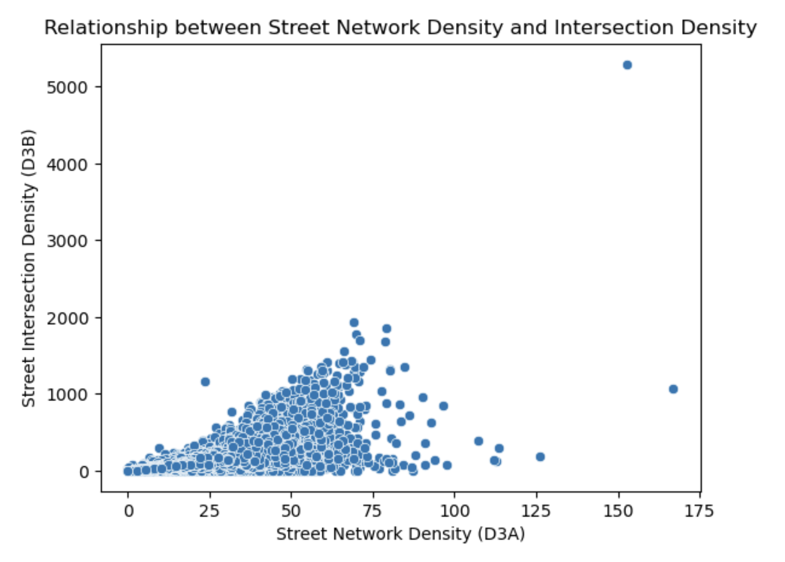
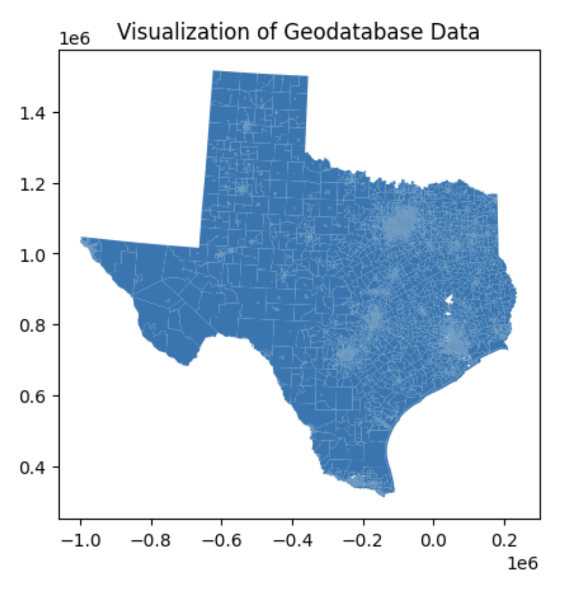
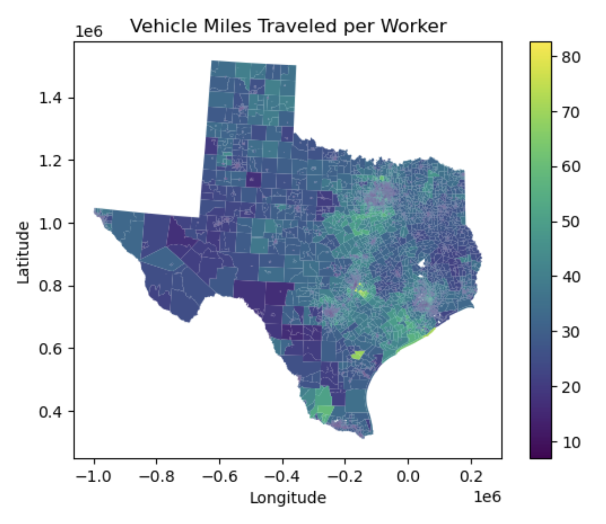
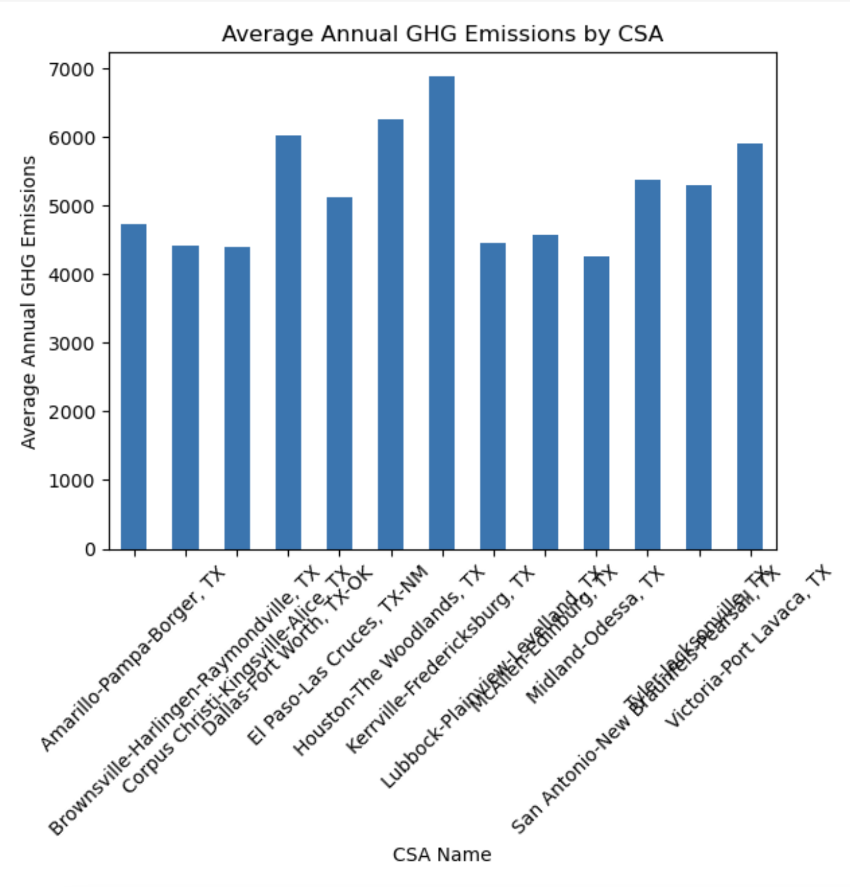
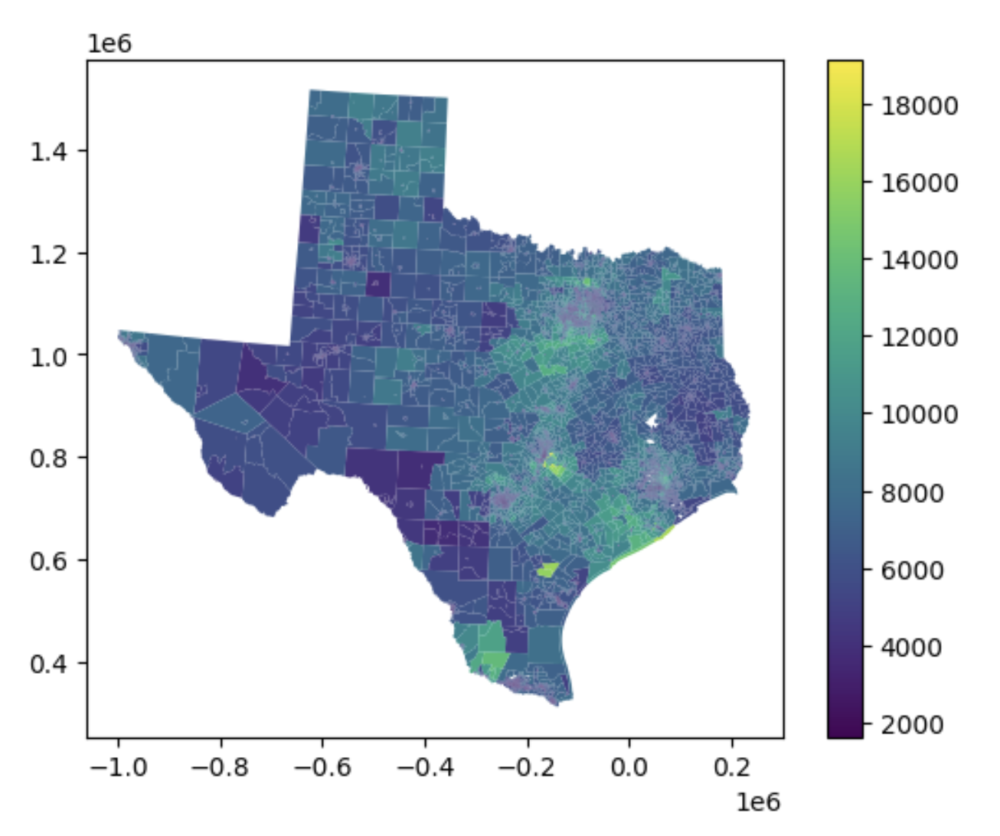
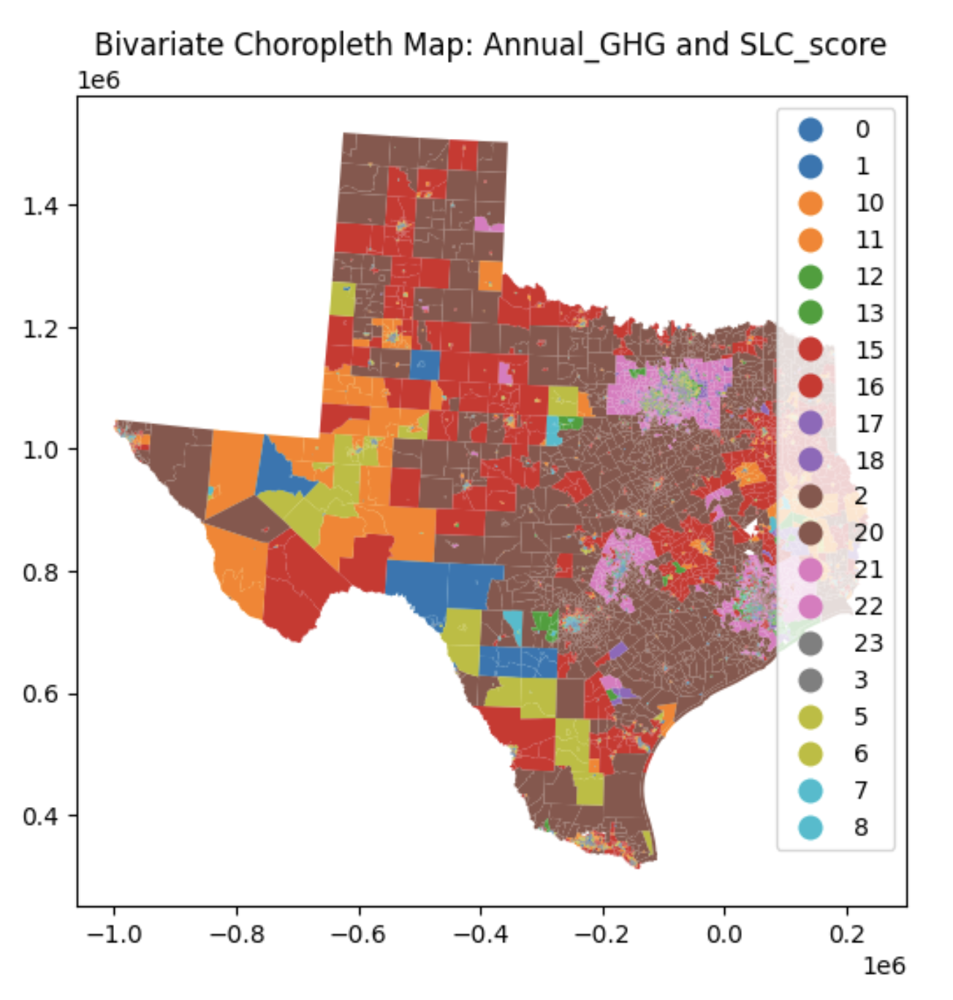

# Smart Location Database Project

## Table of Contents
1. [Introduction](#1-introduction)
2. [Motivation](#2-motivation)
3. [Dataset](#3-dataset)
5. [Overview](#5-overview)
6. [Evaluation](#6-evaluation)
7. [Results](#7-results)
8. [Conclusion](#8-conclusion)

---

### 1. Introduction
The Smart Location Database (SLD) project aims to explore the relationship between land use, urban form, and transportation outcomes. Research has shown that compact, walkable neighborhoods with access to public transit can positively impact transportation choices, reduce emissions, and improve overall quality of life. The project utilizes data from the U.S. Environmental Protection Agency (EPA) and U.S. General Services Administration (GSA) Smart Location Database to analyze various demographic, employment, and built environment variables across Census block groups (CBGs) in the United States.

### 2. Motivation
Urban sprawl, increasing greenhouse gas emissions, and changing transportation habits underscore the necessity of rethinking urban planning strategies. By leveraging the Smart Location Database and integrating Big Data tools, the project aims to decipher current trends and predict future behaviors. The primary motivation is to optimize resource usage, provide environmental benefits, promote responsible urban planning, and ultimately enhance the quality of life for residents.

### 3. Dataset
The dataset used in this project is the Smart Location Database, which aggregates demographic, employment, and built environment variables for every CBG in the United States. This database encompasses indicators related to density, diversity, design, transit accessibility, and destination accessibility. These variables serve as inputs for travel demand models, scenario planning studies, and composite indicators to assess the location efficiency of CBGs within U.S. metropolitan regions.

### 5. Overview
The project aims to:
- Capture the relationships between urban form, land use, and transportation.
- Address environmental concerns by optimizing resource usage and promoting sustainable transportation choices.
- Build adaptable urban planning strategies using a data-driven approach.
- Improve quality of life by promoting healthier environments and sustainable transportation options.

### 6. Evaluation
Evaluation of the project will involve:
- Accuracy assessment using metrics such as Mean Absolute Error (MAE), Root Mean Squared Error (RMSE), and R-squared.
- Scalability testing by increasing dataset size and monitoring system performance.
- Usability evaluation through user surveys measuring task completion rate, error rate, and user satisfaction scores.

### 7. Results

The results showcase the following aspects:

#### Relationship between Street Network Density and Intersection Density:
A scatter plot using Seaborn (`sns.scatterplot()`) to visualize the relationship between two variables (`D3A` and `D3B`).

#### Visualization of Geodatabase Data:
Reading geospatial data from a Geodatabase, creating a basic visualization of the data using GeoPandas.

#### Vehicle Miles Traveled per Worker:
A choropleth map where different colors represent varying values of vehicle miles traveled per worker across geographical areas specified by the GeoDataFrame `gdf`.

#### Average Annual GHG Emissions:
Comparing the average annual GHG emissions across different `CSAName` regions, providing insights into the distribution or variation of emissions in those areas.

#### Choropleth Visualization:
A choropleth map with colors representing the `AnnualGHG` column’s values, grouped into intervals of equal size. It visualizes the spatial distribution of greenhouse gas emissions across different regions in the dataset, helping to identify areas with varying levels of emissions.

#### Bivariate Choropleth Map:
Visualizing the combined effect of both `AnnualGHG` and `SLCscore` columns by assigning a categorical color scheme based on their respective quantiles, providing insights into the relationship between these variables across geographical regions.

### 8. Conclusion
The project contributes to understanding the relationship between urban form, transportation, and environmental sustainability. By utilizing data-driven approaches, it aims to inform urban planning decisions for creating more efficient and sustainable cities.

